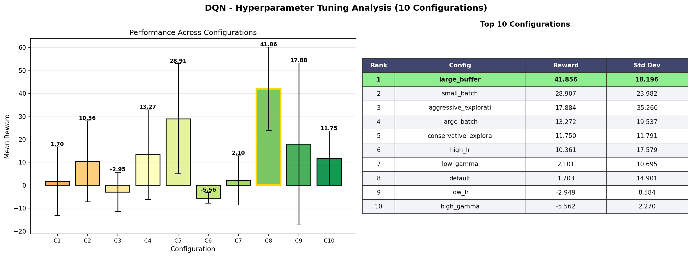
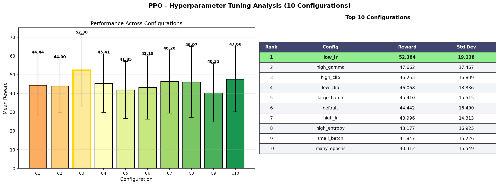
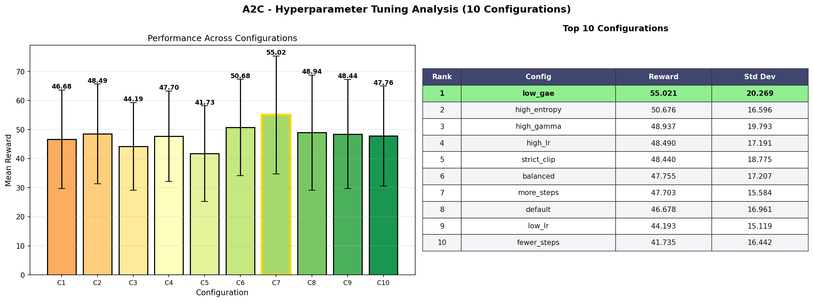
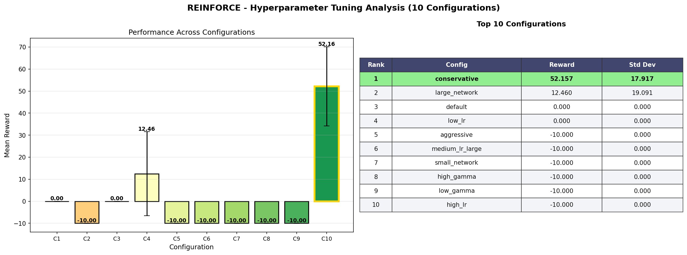

# NutriVision Africa: Mission-Based Reinforcement Learning

**Student:** Raissa IRUTINGABO  
**Course:** Pre-Capstone - Machine Learning Specialization  
**Program:** BSc Software Engineering  
**Date:** 2026-03-31

---

## Abstract

This report presents a mission-based reinforcement learning solution for nutrition recommendation, where an agent learns to select meal-related actions that align with a user's calorie and macro goals (weight loss, gain, or maintenance). A custom Gymnasium environment is designed with realistic constraints, a non-trivial reward structure, and visual simulation support. Four algorithms are trained and compared: DQN, REINFORCE, PPO, and A2C.  

The study includes extensive hyperparameter experiments (10 runs per algorithm), performance visualization, and generalization checks across different random seeds. Results show that policy and value methods can both learn useful behavior in this environment, with performance and stability depending strongly on learning rate, discount factor, exploration settings, and rollout configuration.

\newpage

## 1. Problem Statement and Objectives

### 1.1 Problem
The core problem is meal-action decision making in a daily nutrition mission. The agent must choose between:
- Accepting a recommendation
- Requesting a lower-calorie alternative
- Requesting a higher-protein alternative
- Skipping a meal

The policy should maximize cumulative reward while moving daily intake toward user-specific targets.

### 1.2 Objectives
- Build a custom non-generic RL environment tied to a plausible production use case.
- Train and compare 4 RL methods on the same environment.
- Run broad hyperparameter studies with 10 configurations per algorithm.
- Produce visual and quantitative analysis to explain behavior and convergence.

\newpage

## 2. Environment Design and Validity

### 2.1 Environment Components
- **Action Space:** `Discrete(4)` with exhaustive mission-relevant decisions.
- **Observation Space:** 15-dimensional numeric state capturing goal context, meal nutrition, and progress indicators.
- **Start State:** Reset initializes profile/meal dynamics and progress counters.
- **Terminal Conditions:** Episode ends when meal/day progression reaches terminal criteria.
- **Reward Design:** Positive reward for actions aligned with mission goal; penalties for suboptimal intervention behavior.

### 2.2 Complexity and Realism
This is not a toy grid world. The environment models nutritional trade-offs, multi-objective balancing (calories/macros), and behavior adaptation through alternative requests. This reflects a realistic recommendation pipeline with explainable decision points.

### 2.3 Visualization Layer
- Pygame-based runtime simulation (`environment/pygame_viz.py`)
- Static visual outputs and analysis plots (`environment/rendering.py`, `analyze_results.py`)
- Architecture and flow diagrams (`environment/architecture_diagrams.py`)

### 2.4 Environment Diagrams


\newpage

## 3. Implementation and Project Structure

### 3.1 Required Structure Compliance
The implementation includes all mandatory files:
- `environment/custom_env.py`
- `environment/rendering.py`
- `training/dqn_training.py`
- `training/pg_training.py`
- `models/dqn/`, `models/pg/`
- `main.py`
- `requirements.txt`
- `README.md`

### 3.2 Additional Engineering Components
- `training/reinforce_training.py` for custom REINFORCE
- `train_all.py` orchestrator for multi-algorithm execution
- `analyze_results.py` for standardized analysis artifacts
- `random_demo.py` for non-trained random policy visualization

### 3.3 Random-Agent Demonstration
The project includes random action simulation evidence:


\newpage

## 4. Training Setup and Hyperparameter Experiments

### 4.1 Algorithms
- **Value-Based:** DQN
- **Policy Methods:** REINFORCE, PPO, A2C

### 4.2 Experiment Design
- 10 hyperparameter configurations per algorithm
- Consistent environment and evaluation logic for objective comparison
- Performance measured via mean episodic reward and variance

### 4.3 Hyperparameter Result Tables

#### DQN (10 runs)


#### PPO (10 runs)


#### A2C (10 runs)


#### REINFORCE (10 runs)


\newpage

## 5. Results and Comparative Analysis

### 5.1 Hyperparameter Behavior by Algorithm








### 5.2 Cross-Algorithm Comparison


### 5.3 Generalization Test


\newpage

## 6. Discussion

### 6.1 Learning Stability and Convergence
- Learning rate and gamma are the strongest global drivers.
- DQN sensitivity to exploration schedule and batch sizing is visible in reward spread.
- PPO/A2C stability depends on rollout horizon (`n_steps`) and entropy tuning.
- REINFORCE shows higher variance, but can still produce strong top configurations.

### 6.2 Exploration vs Exploitation
- DQN relies on epsilon schedule to avoid early premature convergence.
- PPO/A2C entropy coefficients regulate policy diversity and training robustness.
- REINFORCE depends on policy-gradient variance reduction through architecture and tuning.

### 6.3 Practical Pipeline Readiness
The project includes reusable model artifacts, summarized metrics, and scripts that support repeatable training/evaluation. This is suitable for integration into a service layer where recommendations are consumed by web/mobile frontends.

\newpage

## 7. Rubric Mapping and Evidence

### 7.1 Environment Validity & Complexity
- Custom mission environment with meaningful action/state/reward design.
- Non-trivial dynamics and realistic objective framing.

### 7.2 Hyperparameter Experiments & Analysis
- Four algorithms included.
- 10-run tables per algorithm included.
- Visual + numerical analysis artifacts generated.

### 7.3 System Implementation & Agent Behavior
- GUI-based simulation available (Pygame).
- Random-policy and trained-agent playback scripts provided.
- API/pipeline extensibility modules included.

### 7.4 Discussion & Analysis
- Required comparison and generalization visuals included.
- Interpretation links behavior to hyperparameter choices.

### 7.5 Video Demonstration (Pending Student Capture)
Add your final recording evidence here:
- [ ] Camera on
- [ ] Full-screen shared
- [ ] Problem statement
- [ ] Reward structure explanation
- [ ] Objective explanation
- [ ] GUI + terminal outputs shown
- [ ] Best model run and interpreted

\newpage

## 8. Conclusion and Next Steps

This work demonstrates a complete RL experimentation workflow for a mission-driven nutrition decision environment. The implementation satisfies structural requirements, compares four core algorithms under broad tuning, and provides reproducible analysis outputs.

Future work can expand menu diversity, incorporate real user telemetry, and deploy inference behind an API to support product-level recommendation experiences.

---

## Appendix A: Reproducibility Commands

```bash
pip install -r requirements.txt
python train_all.py
python analyze_results.py
python random_demo.py
python main.py --pygame
```

## Appendix B: Conversion to PDF

Use one of the following:

1. Open this Markdown in your editor and **Print to PDF**.
2. Use Pandoc:
```bash
pandoc outputs/reports/SUMMATIVE_FINAL_REPORT_DRAFT.md -o outputs/reports/SUMMATIVE_FINAL_REPORT_DRAFT.pdf
```
