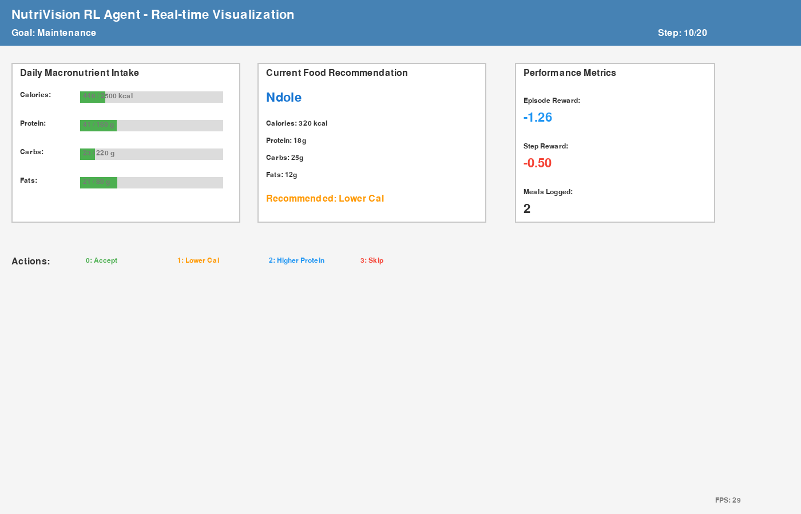
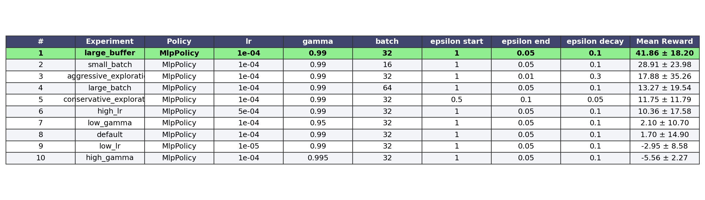
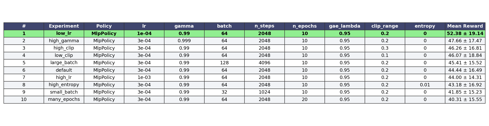
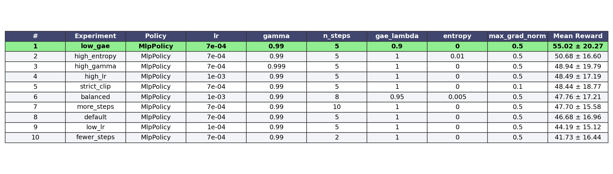
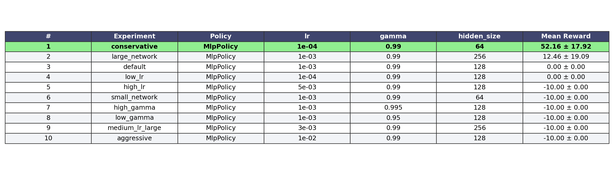
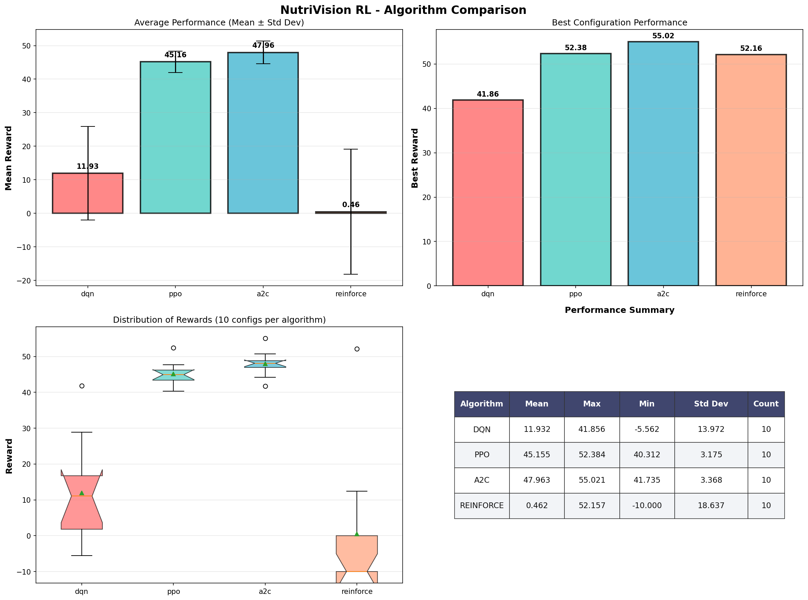
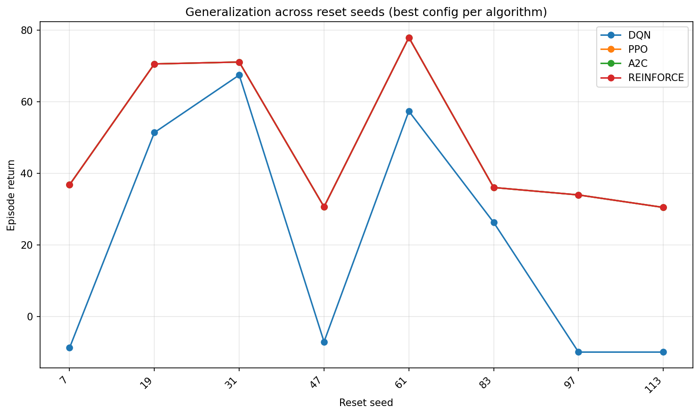

# RL Summative Report (Template-Based)

**Student:** Raissa IRUTINGABO  
**Course:** Pre-Capstone - Machine Learning Specialization  
**Program:** BSc Software Engineering  
**Project:** NutriVision Africa - Mission-Based Reinforcement Learning  
**Date:** 2026-03-31

---

## Overview

This assignment trains and compares reinforcement learning methods in a mission-based custom environment for nutrition decision support. The environment models realistic food recommendation actions against calorie and macro goals (weight loss, weight gain, maintenance).

Compared methods:
- **Value-Based:** DQN
- **Policy Methods:** REINFORCE, PPO, A2C

All methods use the same environment for objective comparison.

## Tasks and Implementation

### 1) Develop a non-generic environment

Implemented in `environment/custom_env.py`:
- **Action Space (Discrete 4):**
  - `0`: Accept recommendation
  - `1`: Request lower-calorie alternative
  - `2`: Request higher-protein alternative
  - `3`: Skip meal
- **Observation Space:** 15-dimensional numeric vector (`Box(0, 5000)`).
- **Rewards:** Action- and state-dependent reward aligned with nutrition targets.
- **Start State:** Random goal and fresh daily nutrition counters.
- **Terminal Conditions:** Max steps reached or threshold overrun for some goals.

### 2) Visualize environment using advanced simulation library

- **Primary coursework visualization:** Pygame (`environment/pygame_viz.py`)
- **Extension:** Unity replay + interactive bridge (`unity_bridge/`)

### 3) Random-action static demonstration

Generated with `random_demo.py`:



### 4) Add architecture / simulation diagrams

Generated with `python -m environment.architecture_diagrams`:


## RL Models Implemented

### Value-Based
- **DQN** (`training/dqn_training.py`)

### Policy Gradient Methods
- **REINFORCE** (`training/reinforce_training.py`, integrated via `training/pg_training.py`)
- **PPO** (`training/pg_training.py`)
- **A2C** (`training/pg_training.py`)

All algorithms train on the same `NutriVisionEnv`.

## Hyperparameter Tuning (10 runs per algorithm)

The project includes exactly 10 experiment configurations per algorithm:
- DQN: 10
- PPO: 10
- A2C: 10
- REINFORCE: 10

Total runs: **40**

### DQN table (10)


### PPO table (10)


### A2C table (10)


### REINFORCE table (10)


## Results and Behavior Observations

### Aggregate performance summary

From `models/master_training_results.json`:
- **Best overall algorithm:** `A2C`
- **Best reward:** `55.021`
- **Algorithm means:**  
  - A2C: `47.963`  
  - PPO: `45.155`  
  - DQN: `11.932`  
  - REINFORCE: `0.462`

### Hyperparameter behavior
- Learning rate and gamma strongly affect convergence across all methods.
- DQN sensitivity observed in exploration and replay-buffer settings.
- PPO/A2C stability improves with tuned rollout/entropy settings.
- REINFORCE shows high variance; one config performs very well while many collapse.

### Comparative visualizations




## Discussion and Analysis (Rubric-Aligned)

### Environment Validity & Complexity
- Environment includes meaningful action choices and non-trivial nutrition dynamics.
- Rewards are structured to encourage realistic goal-oriented decisions.

### Hyperparameter Experiments & Analysis
- All four required tables are complete with 10 rows each.
- Hyperparameter columns vary (learning rate, gamma, entropy, batch/steps, exploration).
- Tuning effects are visible in both tables and plots.

### System Implementation & Agent Behavior
- Pygame simulation demonstrates visible agent-environment interaction.
- Best trained policies show goal-directed behavior during playback.
- Code structure supports future API/mobile/web integration.

### Discussion & Visual Evidence
- Included: reward and ranking plots, algorithm comparison, generalization testing.
- Quantitative and qualitative interpretation provided for stability/convergence.

## Video Demonstration Checklist

- [ ] Full screen shared
- [ ] Camera ON
- [ ] Briefly state problem
- [ ] Explain reward structure
- [ ] State objective of the agent
- [ ] Run best-performing agent with GUI + terminal output visible
- [ ] Explain observed behavior and performance

## Required Project Structure

```text
project_root/
├── environment/
│   ├── custom_env.py
│   ├── rendering.py
├── training/
│   ├── dqn_training.py
│   ├── pg_training.py
├── models/
│   ├── dqn/
│   └── pg/
├── main.py
├── requirements.txt
└── README.md
```

## Conclusion

This implementation satisfies the assignment goals with a custom mission-based environment, four RL methods, 10 hyperparameter runs per method, and complete analysis artifacts. A2C produced the best overall performance in this training cycle. The project is also prepared for capstone-level extension through Unity-based visualization and interaction.

